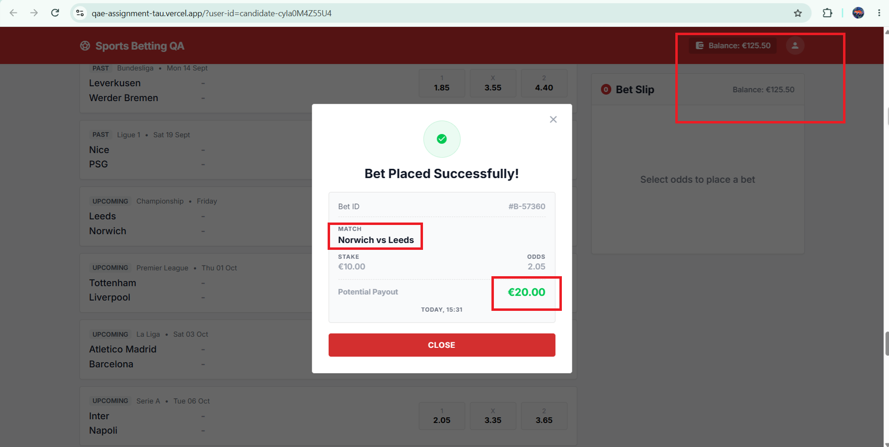
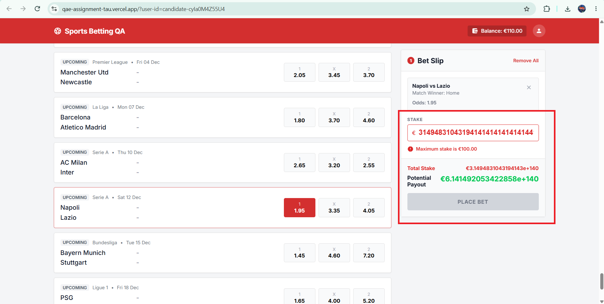
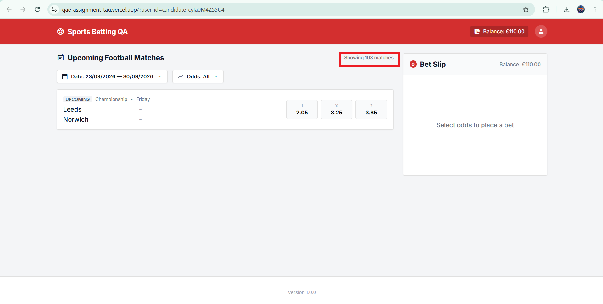
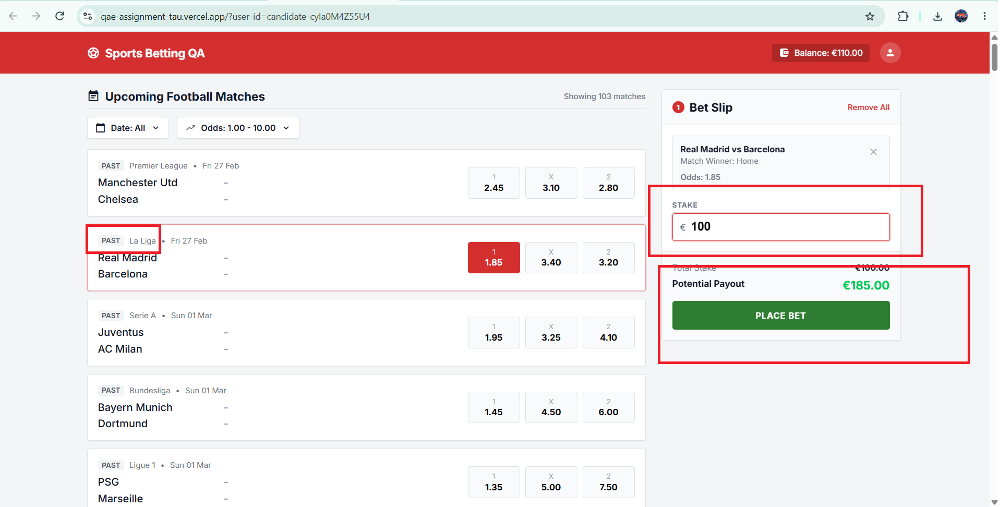

# Manual Test Execution Results

## Execution Summary

- Planned manual test cases: 6

- Executed planned test cases: 3

- Passed: 2

- Failed: 1

- Not executed: 3

- Exploratory checks completed: 6

- Defects logged: 10

  - High severity: 5

  - Medium severity: 5

### Overall Assessment

The critical valid-bet journey was executed and failed because of multiple product defects affecting

receipt accuracy and balance refresh behavior. Insufficient-balance validation and the maximum-stake

boundary behaved as expected during execution.

Three planned manual test cases remain unexecuted and are listed below for transparency. Exploratory

testing also identified additional issues involving large stake inputs, filtering, past-match betting,

receipt interaction, and repeated bet-placement clicks.

## TC-01: Verify successful placement of a valid single bet

Status: Failed

### Test Data

- Match: Leeds vs Norwich

- Selection: Home (Leeds)

- Odds: 2.05

- Stake: €10.00

- Starting balance: €125.50

- Bet ID: #B-57360

### Actual Results

- The bet slip showed the correct selection, odds, and €20.50 potential payout.

- A success receipt appeared.

- The receipt showed Norwich vs Leeds instead of Leeds vs Norwich.

- The receipt showed €20.00 potential payout instead of €20.50.

- The selected outcome was missing from the receipt.

- Both balances remained €125.50 after placement and closing the receipt.

- After refreshing, both balances correctly showed €115.50.

- The bet slip was empty after closing the receipt.

Related defects: BUG-01, BUG-02, BUG-03, BUG-04.

---

## TC-02: Verify bet cannot be placed when stake exceeds available balance

Status: Passed

### Test Data

- Match: Juventus vs Roma

- Selection: Away (Roma)

- Odds: 4.40

- Available balance: €20.00

- Stake: €25.00

- Potential payout: €110.00

### Actual Results

- The application displayed “Insufficient balance” when a €25.00 stake was entered against an available balance of €20.00.

- The stake field was highlighted as invalid.

- The Place Bet button was disabled.

- The potential payout was correctly calculated as €110.00.

- The user was prevented from submitting the bet.

- The available balance remained €20.00.

### Expected Result

The application should prevent bet placement when the entered stake is greater than the user's available balance and should display a clear validation message.

### Result

Passed — the application correctly prevented the bet from being placed due to insufficient balance.

---

## TC-03: Verify maximum stake limit

Status: Passed

### Test Data

- Match: Inter vs Napoli

- Selection: Away (Napoli)

- Odds: 3.65

- Available balance: €120.00

- Boundary values tested:

  - €99.99

  - €100.00

  - €100.01

### Actual Results

- A stake of €99.99 was accepted.

- No validation error was displayed for €99.99.

- The Place Bet button remained enabled.

- A stake of €100.00 was accepted.

- No validation error was displayed for €100.00.

- The Place Bet button remained enabled.

- A stake of €100.01 displayed the validation message “Maximum stake is €100.00”.

- The Place Bet button was disabled for €100.01.

- The potential payout continued to calculate based on the entered stake and selected odds.

### Expected Result

The application should allow stakes up to and including €100.00.

Any stake greater than €100.00 should be rejected with a clear validation message, and the Place Bet button should be disabled.

### Result

Passed — the application correctly enforces the €100.00 maximum stake boundary.

---

## TC-04: Verify a new selection replaces the previous selection

Status: Not Executed

### Execution Note

This planned test case was not executed in full.

Selection-switching behavior was partially observed during Exploratory Check 02, where selecting a

different match/outcome replaced the previous selection and only one active selection remained.

However, the complete planned TC-04 flow was not executed and is therefore not marked Passed.

---

## TC-05: Verify invalid stake inputs cannot be used to place a bet

Status: Not Executed

### Execution Note

No complete execution evidence was recorded for the planned empty, non-numeric, and over-precision

stake-input scenarios.

---

## TC-06: Verify selection removal using X and Remove All

Status: Not Executed

### Execution Note

No complete execution evidence was recorded for the planned per-selection X removal and Remove All

flows.

---

# Exploratory Testing

## Exploratory Check 01: Excessively large stake input

### Observation

The Stake field accepts an extremely large numeric value even though the maximum permitted stake is €100.00.

The application correctly displays “Maximum stake is €100.00” and disables the Place Bet button.

However, Total Stake and Potential Payout continue to calculate using the invalid value and are displayed in scientific notation.

Related defect: BUG-06.

---

## Exploratory Check 02: Switching bet selections

### Observation

Selecting a different match/outcome replaces the previous selection in the bet slip.

Only one active selection remains at a time.

The previously entered stake resets to €0.00 when the selection changes.

No defect was raised because the expected stake-retention behavior is not defined in the available requirements.

## Exploratory Check 03: Odds range filtering

### Observation

The Odds filter was set to 4.90–5.00.

The application correctly reduced the visible results to matches

containing odds within the selected range.

Two matches were displayed and each contained an odd of 5.00.

However, the match counter remained “Showing 103 matches” instead

of updating to reflect the filtered result count.

Related defect: BUG-07.

## Exploratory Check 04: Betting on past matches

### Observation

A match marked as PAST was selected during exploratory testing.

The application allowed the past match to be added to the bet slip,

accepted a valid stake, calculated the potential payout, and enabled

the Place Bet button.

Related defect: BUG-08.

## Exploratory Check 05: Rapid repeated clicks on receipt Close button

### Observation

After successful bet placement, the Close button on the receipt was

clicked multiple times rapidly.

This resulted in inconsistent Bet ID behavior instead of the close

action being handled only once.

Related defect: BUG-09.

## Exploratory Check 06: Repeated clicks during bet placement

### Observation

The Place Bet button was clicked repeatedly while the application

was in the “PLACING...” state.

Multiple “Something went wrong” dialogs appeared, multiple close

actions were required, and the user's balance was deducted multiple

times.

After refresh, the UI balance showed €12.47.

GET /api/balance also returned €12.47, confirming that the repeated

balance deductions were persisted in the backend.

Related defect: BUG-10.

---

# Defect Reports

## BUG-01: Balance updates only after refreshing the page following successful bet placement

Severity: High

### Steps to Reproduce

1. Open the application in desktop Chrome using the assigned User ID.

2. Verify that the starting balance is €125.50.

3. Select Home (1) for Leeds vs Norwich at odds of 2.05.

4. Enter a stake of €10.00.

5. Click Place Bet once.

6. Observe both balances when the success receipt appears.

7. Close the receipt and check both balances again.

8. Refresh the page and check both balances again.

### Expected Result

The header and bet-slip balances show €115.50 after deducting the €10.00 stake.

### Actual Result

Both balances remain €125.50 after successful placement and after closing the receipt. After refreshing the page, both balances correctly show €115.50.

### Business Impact

Users see an incorrect available balance after placing a bet, which can mislead them when placing further bets.

### Evidence

- Bet ID: #B-57360.
- The success receipt shows the balance still at €125.50 immediately after the bet was placed.



---

## BUG-02: Success receipt shows an incorrect potential payout

Severity: High

### Steps to Reproduce

1. Open the application using the assigned User ID.

2. Select Home (1) for Leeds vs Norwich at odds of 2.05.

3. Enter a stake of €10.00.

4. Observe the potential payout in the bet slip.

5. Click Place Bet and check the success receipt.

### Expected Result

The receipt shows a potential payout of €20.50:

€10.00 × 2.05 = €20.50.

This matches the amount shown in the bet slip before placement.

### Actual Result

The bet slip shows €20.50 before placement, but the success receipt shows €20.00. The receipt still shows a €10.00 stake and odds of 2.05.

### Business Impact

The receipt understates the potential return by €0.50, giving users conflicting information about their bet.

### Evidence

- The receipt shows a €10.00 stake and odds of 2.05.
- Expected potential payout: €20.50.
- Actual potential payout shown in the receipt: €20.00.


---

## BUG-03: Success receipt reverses the home and away team order

Severity: Medium

### Steps to Reproduce

1. Open the application using the assigned User ID.

2. Locate Leeds vs Norwich, with Leeds listed as the home team.

3. Select Home (1).

4. Enter a stake of €10.00.

5. Click Place Bet and check the match name on the receipt.

### Expected Result

The receipt shows Leeds vs Norwich, matching the team order in the match list and bet slip.

### Actual Result

The receipt shows Norwich vs Leeds.

### Business Impact

Reversing the team order can confuse users about which team their Home or Away selection refers to.

### Evidence

- The match list shows Leeds vs Norwich.
- The success receipt shows Norwich vs Leeds.


---

## BUG-04: Selected outcome is missing from the success receipt

Severity: Medium

### Steps to Reproduce

1. Open the application using the assigned User ID.

2. Select Home (1) for Leeds vs Norwich.

3. Verify that the bet slip shows “Match Winner: Home”.

4. Enter a stake of €10.00.

5. Click Place Bet and inspect the success receipt.

### Expected Result

The receipt includes the selected outcome, identifying Home / Leeds as the selection.

### Actual Result

The receipt shows the match, stake, odds, potential payout, Bet ID, and timestamp, but does not show the selected outcome.

### Business Impact

Users cannot confirm from the receipt whether their bet was placed on Home, Draw, or Away.

### Evidence

- The success receipt contains the Bet ID, match, stake, odds, potential payout, and timestamp.
- The selected Home / Draw / Away outcome is not displayed.


---

## BUG-05: Balance reset API response does not match the persisted user balance

Severity: High

### Steps to Reproduce

1. Open Swagger using the assigned User ID.

2. Execute the balance reset API.

3. Observe the response returned by the reset API.

4. Open the betting application and refresh the page.

5. Observe the balance shown in the header and bet slip.

6. Return to Swagger.

7. Execute GET /api/balance using the same User ID.

8. Compare the balance returned by the reset API, GET balance API, and the betting application.

### Expected Result

The balance returned by the reset API should match the balance persisted for the user and displayed in the betting application.

If the reset API returns €125.50, both GET /api/balance and the application should also show €125.50.

### Actual Result

The balance reset API returns €125.50 and reports that the balance was reset successfully.

However, after refreshing the betting application, both the header and bet-slip balances show €120.00.

Executing GET /api/balance also returns:

```json

{

  "balance": 120,

  "currency": "EUR"

}

```

Therefore, the €125.50 returned by the reset API does not match the actual persisted balance of €120.00.

### Business Impact

The reset API returns an incorrect balance value, which can cause users, testers, or automated tests to rely on an incorrect account balance.

This can lead to incorrect test setup, failed downstream test cases, incorrect stake calculations, and inconsistent behavior between the API and the user interface.

It also reduces confidence in the balance-management functionality, which is critical in a betting application.

### Evidence

- Screen recording captures the reset-balance response and the persisted balance mismatch for the same assigned User ID.

[View BUG-05 screen recording](Evidence/BUG-05.mp4)

---

## BUG-06: Stake field allows excessively large numeric input beyond the maximum stake limit

Severity: Medium

### Steps to Reproduce

1. Open the application using the assigned User ID.

2. Select any valid upcoming match and outcome.

3. Enter an extremely large numeric value in the Stake field.

4. Observe the Stake field, validation message, Total Stake, Potential Payout, and Place Bet button.

### Expected Result

The Stake field should restrict input to a reasonable numeric range based on the maximum allowed stake of €100.00.

Values far beyond the supported stake limit should either be prevented from being entered or handled without producing unreadable monetary values.

### Actual Result

The Stake field accepts an extremely large numeric value even though the maximum permitted stake is €100.00.

The application correctly displays:

“Maximum stake is €100.00”

and disables the Place Bet button.

However, Total Stake and Potential Payout are still calculated using the extremely large value and are displayed in scientific notation.

### Business Impact

Allowing excessively large numeric input creates a poor user experience and causes monetary values in the bet slip to become difficult to read.

It also performs unnecessary calculations using values that can never be accepted as valid stakes.

Although the bet cannot be submitted, the Stake field should handle invalid values more cleanly and enforce a reasonable input range.

### Evidence

- The screenshot shows the excessively large stake value, maximum-stake validation, and resulting monetary display behavior.



---

## BUG-07: Match count does not update after applying odds filter

Severity: Medium

### Steps to Reproduce

1. Open the Sports Betting QA application.

2. Open the Odds filter.

3. Set the minimum odds to 4.90.

4. Set the maximum odds to 5.00.

5. Click Apply.

6. Observe the filtered match list and the match count displayed

   beside “Upcoming Football Matches”.

### Expected Result

The displayed match count should update to reflect the number of

matches matching the selected odds range.

For the 4.90–5.00 range, 2 matches are displayed, so the page

should show “Showing 2 matches”.

### Actual Result

Only 2 matching events are displayed after applying the 4.90–5.00

odds filter.

However, the page still displays:

“Showing 103 matches”

which represents the unfiltered match count.

### Business Impact

Users receive conflicting information about the number of results

returned by the filter, which can reduce confidence in the filtering

functionality and make it difficult to understand how many matches

actually satisfy the selected criteria.

### Evidence

- The screenshot shows the odds-filtered results while the displayed match count remains inconsistent.



---

## BUG-08: Application allows users to place bets on past matches

Severity: High

### Steps to Reproduce

1. Open the Sports Betting QA application.

2. Locate a match marked as PAST.

3. Select any available outcome for the past match.

4. Observe that the selection is added to the bet slip.

5. Enter a valid stake, for example €10.00.

6. Observe the Place Bet button.

### Expected Result

Past matches should not be available for betting.

Odds for matches marked as PAST should either be disabled or

non-interactive, and users should not be able to add them to the

bet slip or proceed with bet placement.

### Actual Result

The application allows odds for a match marked as PAST to be selected.

The past match is added to the bet slip, a stake can be entered,

a potential payout is calculated, and the Place Bet button becomes

enabled.

### Business Impact

Allowing bets on already completed events can compromise betting

integrity and may allow users to place wagers after the outcome of

an event is already known.

This is a high-impact issue for a betting application because it

can create financial and regulatory risk.

### Evidence

- The screenshot shows a PAST match being selectable and available in the betting flow.



---

## BUG-09: Repeated clicks on the receipt Close button cause inconsistent Bet ID behavior

Severity: Medium

### Steps to Reproduce

1. Place a valid bet successfully.

2. Wait for the success receipt to appear.

3. Note the Bet ID displayed on the receipt.

4. Click the Close button multiple times rapidly.

5. Observe the receipt and Bet ID behavior.

### Expected Result

The Close action should be processed only once.

Repeated clicks on the Close button should not create, update,

duplicate, or otherwise affect the Bet ID or bet record.

The receipt should simply close after the first click.

### Actual Result

When the Close button is clicked multiple times rapidly, the Bet ID

behavior becomes inconsistent.

The Close action appears to be processed more than once instead of

being safely handled as a single UI action.

### Business Impact

Repeated processing of a receipt action can create confusion around

bet identification and may indicate duplicate or unintended handling

of the same successful bet.

For a betting application, each placed bet must remain associated

with one stable and unique Bet ID.

### Evidence

- Screen recording captures the inconsistent Bet ID behavior after repeated clicks on the receipt Close button.

[View BUG-09 screen recording](Evidence/BUG-09__BetID.mp4)

---

## BUG-10: Multiple clicks during bet placement cause repeated balance deductions and multiple error dialogs

**Severity:** High

### Steps to Reproduce

1. Open the application using the assigned User ID.

2. Select a valid upcoming match and outcome.

3. Enter a valid stake.

4. Click **Place Bet**.

5. While the button displays **“PLACING...”**, click it multiple times rapidly.

6. Observe the error dialogs and receipt behavior.

7. Close the displayed dialogs/receipt.

8. Refresh the application.

9. Execute `GET /api/balance` using the same User ID.

10. Compare the resulting balance with the balance before the repeated-click action.

### Expected Result

Once bet placement starts, the **Place Bet** button should become non-interactive until the request completes.

Additional clicks during the **“PLACING...”** state should be ignored.

Only one bet request should be processed, only one receipt/result should be shown, and the balance should be deducted only once.

### Actual Result

Repeated clicks during the **“PLACING...”** state trigger multiple processing attempts.

Multiple **“Something went wrong”** dialogs are displayed.

The user must perform multiple close actions to dismiss the resulting receipt/error states.

The available balance is deducted multiple times instead of only once.

After refresh, the UI showed a balance of **€12.47**.

`GET /api/balance` also returned:

```json

{

  "balance": 12.47,

  "currency": "EUR"

}

```

### Business Impact

Repeated clicks during bet placement can cause the user's balance to be deducted multiple times for what should be a single betting action.

This creates a direct financial risk because users may lose more money than intended and may not know whether one or multiple bets were actually processed.

The issue can also lead to customer disputes, incorrect account balances, duplicate transaction handling, and loss of trust in the betting platform.

### Evidence

- Screen recording shows repeated clicks during the **“PLACING...”** state.
- Multiple **“Something went wrong”** dialogs are displayed.
- Multiple close actions are required.
- The available balance is reduced multiple times.
- After refresh, the UI balance shows **€12.47**.
- `GET /api/balance` returns the same persisted balance.

```json
{
  "balance": 12.47,
  "currency": "EUR"
}
```

[View BUG-10 screen recording](Evidence/BUG-10.mp4)

---

---

# Automation Execution Evidence

The complete Pytest execution output for the automated UI and API tests is available here:

[View automation test results](Evidence/automation_test_results.txt)
